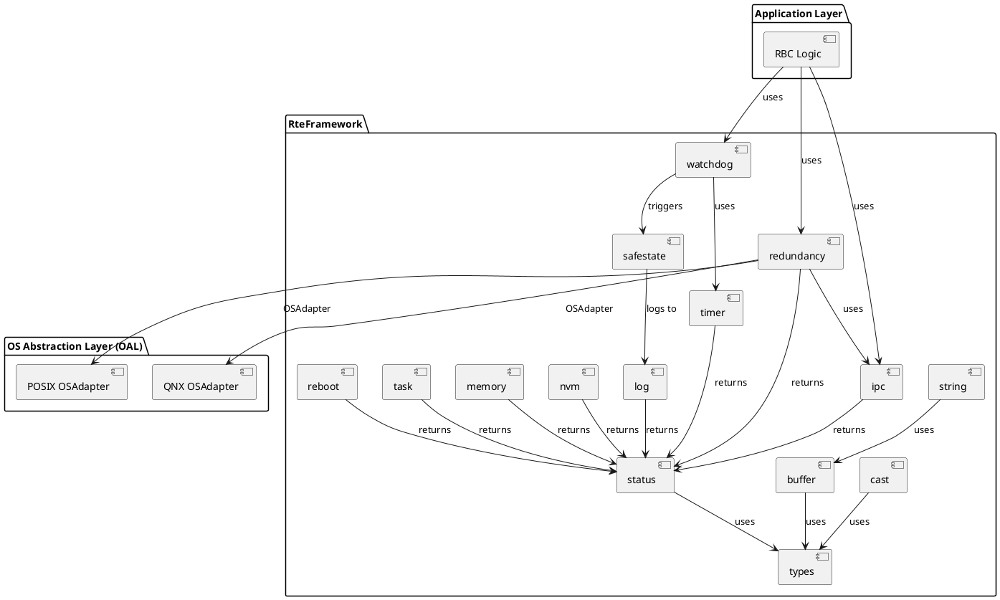
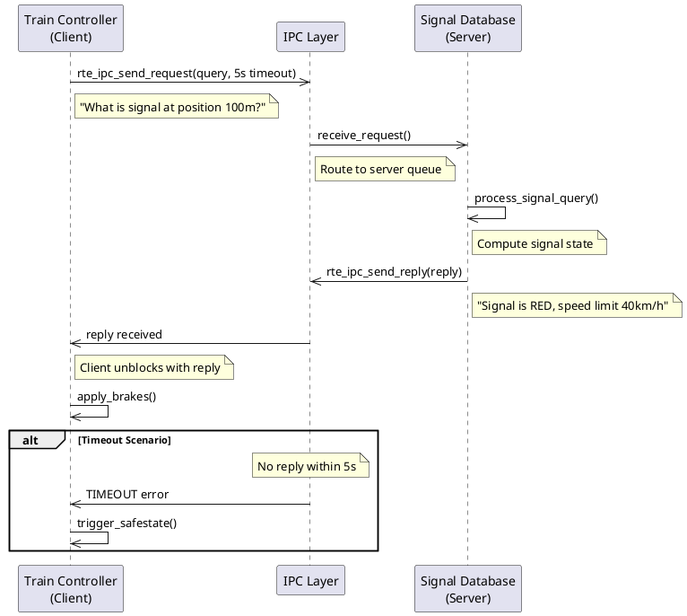
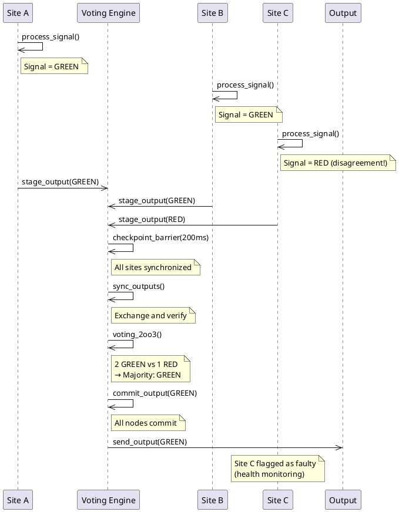
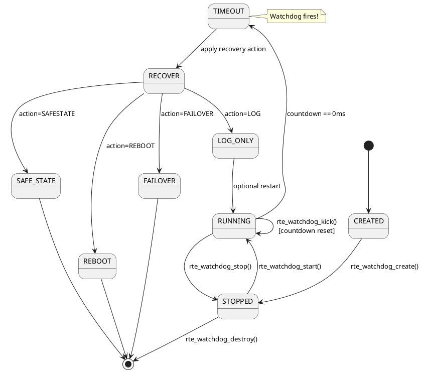
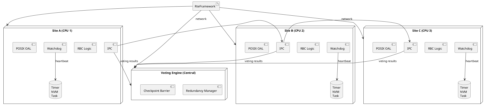
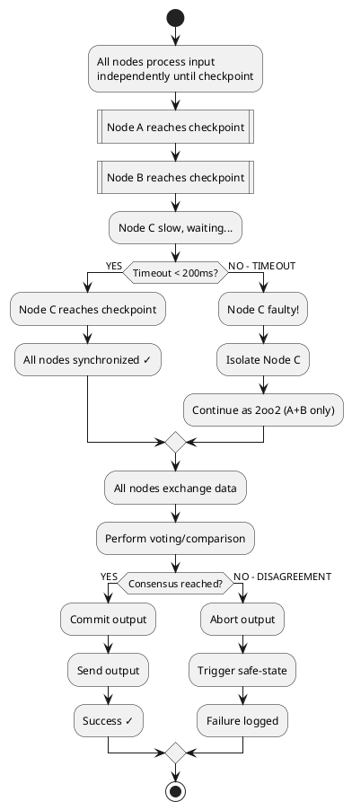
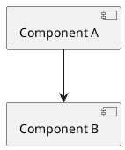
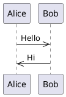
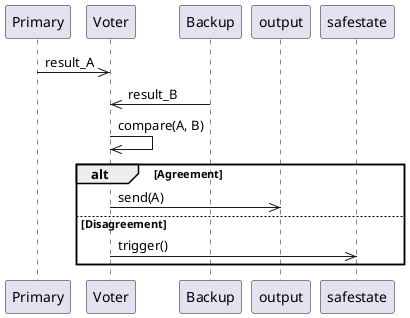
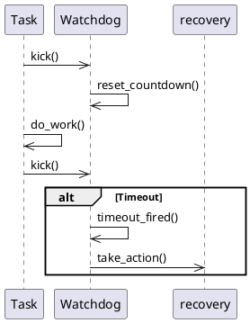

# Architecture Diagrams with PlantUML & Doxygen

This guide explains how to create and embed structural and behavioral diagrams in the architecture documentation using PlantUML.

---

## Overview

**PlantUML** is a UML diagram generation tool that converts text descriptions into visual diagrams. Combined with **Doxygen**, it enables:

- ✅ Structural diagrams (component, class, deployment)
- ✅ Behavioral diagrams (sequence, state machine, activity)
- ✅ Embedded in code comments and markdown
- ✅ Auto-generated from source control
- ✅ Version-tracked alongside code

---

## Setup

### 1. Install PlantUML

```bash
# macOS
brew install plantuml

# Linux
apt-get install plantuml

# Verify
plantuml -version
```

### 2. Configure Doxygen

Update `Doxyfile` to enable PlantUML:

```
PLANTUML_JAR_PATH = /usr/local/bin/plantuml
PLANTUML_INCLUDE_PATH = .
HAVE_DOT = YES
DOT_PATH = /usr/local/bin
```

### 3. Generate Docs

```bash
doxygen Doxyfile
open html/index.html
```

---

## Diagram Types & Examples

### 1. Component Diagram (Structural)

Shows module dependencies and interactions.

**File:** `docs/architecture/diagrams/component-diagram.puml`



**Embed in Doxygen:**

```c
/**
 * @file rte/ipc/rte_ipc.h
 * @brief Inter-Process Communication Module
 * 
 * @startuml component-sapiframework
 * [see diagrams/component-diagram.puml]
 * @enduml
 */
```

---

### 2. Sequence Diagram (Behavioral - IPC)

Shows message flow between components.

**File:** `docs/architecture/diagrams/sequence-ipc-request-reply.puml`



---

### 3. Sequence Diagram (Behavioral - Redundancy)

Shows 2oo3 voting flow.

**File:** `docs/architecture/diagrams/sequence-2oo3-voting.puml`



---

### 4. State Machine Diagram (Behavioral)

Shows watchdog state transitions.

**File:** `docs/architecture/diagrams/statemachine-watchdog.puml`



---

### 5. Deployment Diagram (Structural)

Shows how Platform_RTE is deployed on hardware.

**File:** `docs/architecture/diagrams/deployment-2oo3-cluster.puml`



---

### 6. Activity Diagram (Behavioral - Checkpoint Flow)

Shows checkpoint synchronization workflow.

**File:** `docs/architecture/diagrams/activity-checkpoint-barrier.puml`



---

## Embedding Diagrams in Doxygen Comments

### In Header Files

```c
/**
 * @file rte/ipc/rte_ipc_request_reply.h
 * @brief Request-Reply (RPC) IPC Pattern
 *
 * @section overview Overview
 * 
 * The request-reply pattern implements synchronous RPC communication:
 *
 * @startuml
 * participant "Client" as c
 * participant "Server" as s
 * c ->> s: send_request(query)
 * s ->> c: send_reply(answer)
 * @enduml
 *
 * @see rte_ipc_request_reply_t
 */
```

### In Markdown Files

```markdown
# Module Architecture

## Structural View



## Behavioral View


```

### In ADR Documents

```markdown
# ADR-007: Per-Feature Modular Architecture

## Decision

Each feature is an independent module with clear boundaries.

## Diagram

\`\`\`puml
@startuml
package "RteFramework" {
    [Module A] as modA
    [Module B] as modB
}
modA --> modB: optional dependency
\`\`\`

## Rationale

- Enables independent testing
- Reduces verification scope
- Facilitates reuse
```

---

## Diagram Locations

Organize diagrams in the repo:

```
docs/architecture/
├── diagrams/
│   ├── component-diagram.puml
│   ├── sequence-ipc-request-reply.puml
│   ├── sequence-2oo3-voting.puml
│   ├── statemachine-watchdog.puml
│   ├── deployment-2oo3-cluster.puml
│   ├── activity-checkpoint-barrier.puml
│   └── README.md (diagram index)
├── ADR-001-os-abstraction-layer.md
├── ADR-005-oal-osadapter-registration.md
└── ...
```

---

## Build Diagrams Locally

```bash
# Generate PNG from single diagram
plantuml docs/architecture/diagrams/component-diagram.puml

# Generate all diagrams in directory
plantuml docs/architecture/diagrams/*.puml

# Generate as SVG (vector, better quality)
plantuml -tsvg docs/architecture/diagrams/*.puml

# Verify syntax without generating
plantuml -checkonly docs/architecture/diagrams/component-diagram.puml
```

---

## Doxygen Configuration

Add to `Doxyfile`:

```
# PlantUML settings
PLANTUML_JAR_PATH       = /usr/local/bin/plantuml
PLANTUML_INCLUDE_PATH   = ./docs/architecture/diagrams
PLANTUML_CFG_FILE       = ./plantuml.cfg

# Diagram generation
HAVE_DOT                = YES
DOT_PATH                = /usr/local/bin
MSCGEN_PATH             = /usr/local/bin

# Image output format (PNG or SVG)
DOT_IMAGE_FORMAT        = svg
SVG_DYNAMIC_DEPTH       = 0

# Generate diagrams in documentation
GENERATE_LATEX          = YES
LATEX_BATCHMODE         = YES
```

---

## CI/CD Integration

Add to GitHub Actions workflow:

```yaml
name: Build Documentation

on: [push, pull_request]

jobs:
  docs:
    runs-on: ubuntu-latest
    steps:
      - uses: actions/checkout@v2
      
      - name: Install dependencies
        run: |
          sudo apt-get install -y doxygen graphviz plantuml
      
      - name: Build diagrams
        run: |
          plantuml docs/architecture/diagrams/*.puml
      
      - name: Build documentation
        run: doxygen Doxyfile
      
      - name: Deploy to GitHub Pages
        uses: peaceiris/actions-gh-pages@v3
        with:
          github_token: ${{ secrets.GITHUB_TOKEN }}
          publish_dir: ./html
```

---

## Best Practices

### 1. Diagram Scope

**Keep diagrams focused:**
- ❌ Don't show all modules in one diagram
- ✅ Show one architectural aspect per diagram
- ✅ Use multiple diagrams for complex systems

### 2. Consistency

**Use consistent notation:**
```puml
skinparam componentStyle uml2
skinparam monochrome true
```

### 3. Traceability

**Link diagrams to code:**
```
Component → rte_*.h header file → Implementation
Sequence → Test case → Documented behavior
State Machine → State enum → Code logic
```

### 4. Version Control

**Commit PlantUML source, not generated images:**
```
✅ docs/architecture/diagrams/*.puml (source)
❌ docs/architecture/diagrams/*.png (generated)
```

---

## Common Diagram Patterns for Safety-Critical Systems

### Pattern 1: Fault Tolerance



### Pattern 2: Health Monitoring



### Pattern 3: Layered Architecture

```puml
@startuml layered-arch
package "Application Layer" {
    [RBC Logic]
}
package "Framework Layer (Platform_RTE)" {
    [IPC] [Timer] [Watchdog]
}
package "OAL OSAdapter Layer" {
    [POSIX] [QNX]
}
package "OS/Hardware Layer" {
    [Linux] [RTOS]
}
@enduml
```

---

## References

- **PlantUML:** https://plantuml.com/
- **Doxygen PlantUML Support:** https://doxygen.nl/manual/diagrams.html#msc
- **UML Specification:** https://www.omg.org/spec/UML/
- **SysML:** https://sysml.org/ (for systems engineering)
